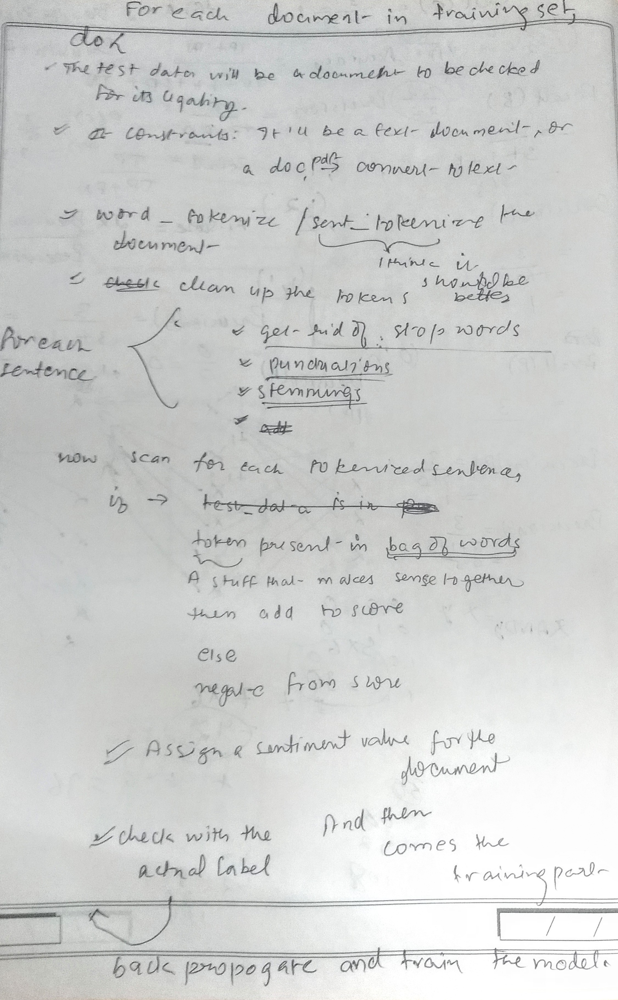

# DOCUMENT LEGALITY IDENTIFIER
___

A project for **Document Legality Identification**, as in, if we're provided with a document, we have to determine whether it's **legal or not**.

Initial **data** has been scraped form the **Legal Terms Dictionary** provided by the ***State of Connecticut*** **Judicial Branch**. And prediction shall be done based on how close the given document is to a real legal document. Given is a primitive initial implementation of the dataset.


Tools and python libraries used for scraping the data:
___

**beautifulSoup4** 
* **```pip install beautifulSoup```**

  or equivalently

* **```pip install bs4```**

**requests**
* **```pip install requests```**
___

## Basic Idea For the Implementation of the Document Legality Identifier
___

** For the Bag of Words creation **
___

*   Clean the complete_legal_terms.csv file. For each legal term in the document: 
    *   Clear off all the punctuations
    *   Get rid of all the stop words
    *   Add these to the vocabulary

___
## VAGUE IDEA
___

Future implementations will be updated soon...
___

Sources:
___

 **[State Of Connecticut-Legal Terms](https://www.jud.ct.gov/legalterms.htm)**

 **[Law.com Legal Dictionary](https://dictionary.law.com/Default.aspx?letter=A)**

 ___
 

